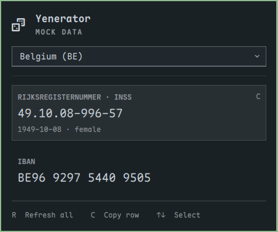

# Yenerator

A small, offline **Omarchy shell plugin** for generating mock data while developing and testing. Uses the installed shell's native popup, theme, and keyboard controls.

- Belgian INSS / rijksregisternummer with a real generated birth date and valid national-register checksum, including the rule for births from 2000 onward.
- One country selector for all fields: Belgium, Netherlands, Germany, and France. Belgium shows INSS and IBAN; other countries show IBAN only.
- Press **R** to regenerate all visible records. Changing country also generates fresh records.
- Hover a row and press **C** to copy its raw value, without spaces or punctuation.
- Use **Up/Down** or **Tab/Shift+Tab** to select a row without the mouse, then **C** to copy. **Escape** closes the country menu first, then the popup.
- R/C shortcuts are inactive while the country menu is open.



The popup uses Omarchy's native hero, section headers, separators, country dropdown, and highlighted rows. Its default outlined ID-card icon (U+F2C3) can be replaced through the widget's `icon` setting. See the [icon options](docs/icons.md) and [design notes](docs/design.md).

## Install

Requires an Omarchy release with the Quickshell shell plugin system (`omarchy plugin --help`). Older Waybar-based releases are not supported. No Node.js or npm packages are needed at runtime.

Install and enable with Omarchy's native installer:

```sh
omarchy plugin install https://github.com/yenst/yenerator.git --enable
```

`install` is an alias for `omarchy plugin add`. Omarchy clones the repository, validates the root `manifest.json`, and installs it under `~/.config/omarchy/plugins/jihmy.yenerator`. The bar placement defaults to the right; the interactive installer may offer a placement choice.

For development, the same command accepts a local Git repository path. The plugin files must be committed first: the installer clones committed files, not working-tree changes.

```sh
omarchy plugin install /absolute/path/to/yenerator --enable
```

Update a Git-installed copy with:

```sh
omarchy plugin update jihmy.yenerator
```

Open from the bar or a terminal:

```sh
omarchy-shell shell toggle jihmy.yenerator
```

Disable with `omarchy plugin disable jihmy.yenerator`. Remove through `omarchy plugin remove jihmy.yenerator`.

## Mock-data scope

These values are generated locally and have valid formats and checksums. They are **not reserved test identifiers** and can coincide with real identifiers. Use them only in test environments. No identity or account lookup is performed, and the plugin stores no generated history (your desktop clipboard manager may retain copied values).

INSS generation covers ordinary Belgian national-register numbers, not BIS numbers. IBANs pass the international MOD-97 check; Belgian BBAN checks and French numeric RIB keys are also calculated. Bank codes and accounts are synthetic. Bank existence, account existence, and additional bank-specific checks are not guaranteed; the Netherlands uses the synthetic bank code `TEST`.

References: [Belgian national-register number specification](https://www.ibz.rrn.fgov.be/sites/default/files/documents/nl/rijksregister/onderrichtingen/IT-lijst/IT000_Rijksregisternummer.pdf) and [SWIFT IBAN Registry](https://www.swift.com/sites/default/files/files/iban-registry-v101.pdf).

## Development

```sh
npm test
omarchy plugin validate .
```

Run `bash tests/keyboard.sh` in an active Omarchy desktop session for the QML keyboard interaction checks. The test opens a temporary popup and intercepts copy dispatch without changing your clipboard.

Generator tests use Node's built-in test runner; there are no npm dependencies. `Generator.js` is plain JavaScript shared by the QML widget and tests. Add future generators there and expose them in `Widget.qml`.

The manifest and QML/JavaScript entry files live at the repository root so the project can be installed directly with Omarchy. No custom installation script is needed.
