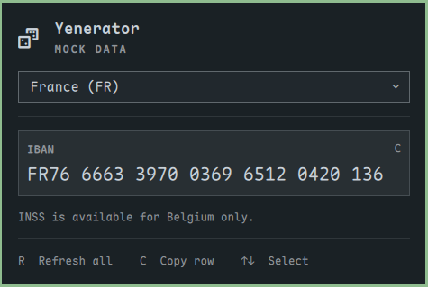

# Yenerator · keyboard-first native panel

The popup uses Omarchy's native 380 px panel, hero, country dropdown, separators,
and CursorSurface row highlighting. All typography, colors, borders, spacing,
and focus treatment come from the current shell theme.

The country selector applies to every visible record. Belgium displays INSS and
IBAN. Netherlands displays BSN and IBAN. Germany and France display IBAN and explain that INSS is only
available for Belgium; a Belgian identifier is never presented as belonging to
another country.

## Interaction

- **R** generates fresh values for all visible fields.
- **C** copies the hovered or keyboard-selected row without separators.
- **Up/Down** selects a row. **Tab/Shift+Tab** moves through the country control
  and rows. Hovering a row selects it, with a shared native highlight.
- **Escape** closes the country menu first, then the popup.
- Opening the country dropdown suspends record shortcuts. Ctrl/Alt/Super
  combinations and auto-repeated R/C events do not regenerate or copy records.
- A short confirmation names the copied record. There are no per-row action
  buttons; the footer keeps the shortcuts visible.

The outlined ID-card glyph (U+F2C3) remains configurable through the widget's `icon` setting. See
[the icon options](icons.md).

## Native references

Read-only references were the installed network, audio, power, and Bluetooth
panels under `/usr/share/omarchy/shell/plugins/panels/`. The implementation uses
`Ui.Panel`, `Ui.KeyboardPanel`, `Ui.PanelHero`, `Ui.PanelSectionHeader`,
`Ui.PanelSeparator`, `Ui.CursorSurface`, and `Ui.Dropdown` directly.

## Validation

Generator tests and native manifest validation pass. `tests/keyboard.sh` runs
real Qt keyboard and hover events in a temporary Quickshell popup: refresh,
copy dispatch, country-menu keyboard selection, hiding unsupported fields,
arrow/Tab navigation, modifier handling, and Escape. Copy dispatch is intercepted
so the test does not change the user's clipboard. Rendering is checked for
Belgium and the longer French IBAN. Other display scales remain untested.
