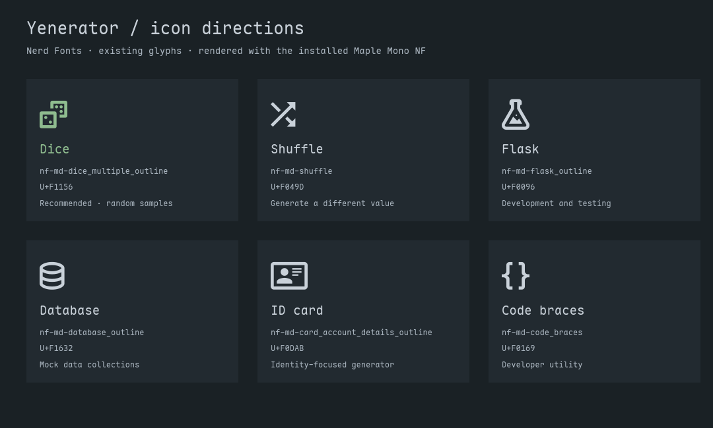

# Icon options

Browse and search the full [Nerd Fonts icon catalog](https://www.nerdfonts.com/cheat-sheet).

These are existing Nerd Fonts Material Design glyphs, verified against the [official glyph catalog](https://github.com/ryanoasis/nerd-fonts/blob/master/glyphnames.json). The preview uses the locally installed Maple Mono NF font.

| Icon | Glyph | Nerd Fonts name | Codepoint | Intended meaning |
|---|---|---|---|---|
| Dice | 󱅖 | `nf-md-dice_multiple_outline` | `U+F1156` | Recommended · random samples |
| Shuffle | 󰒝 | `nf-md-shuffle` | `U+F049D` | Generate a different value |
| Flask | 󰂖 | `nf-md-flask_outline` | `U+F0096` | Development and testing |
| Database | 󱘲 | `nf-md-database_outline` | `U+F1632` | Mock data collections |
| ID card | 󰶫 | `nf-md-card_account_details_outline` | `U+F0DAB` | Identity-focused generator |
| Code braces | 󰅩 | `nf-md-code_braces` | `U+F0169` | Developer utility |

**Selected default:** `nf-fa-id_card_o` / `nf-fa-drivers_license_o` (U+F2C3), the outlined ID-card glyph. The preview above shows the earlier alternatives.

Action glyphs: `nf-md-refresh` (U+F0450) for regeneration and `nf-md-content_copy` (U+F018F) for copying.

The widget uses the shell font and colors; it does not bundle a separate icon font.
